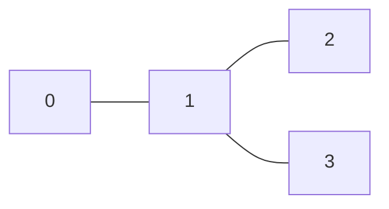
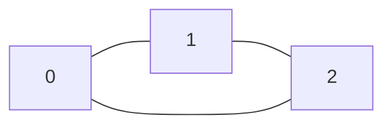
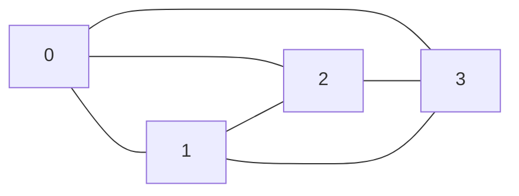

# Treewidth SAT Solver
-   Course: Practice/Real-Life Applications of Computational Algorithms, Spring 2021
    Midterm Project Milestone3 - implement one SAT application
-   Author: 0710006 Ke-Yu Lu
-   Date: May 24, 2021
-   Reference: ["Encoding Treewidth into SAT"](https://link.springer.com/chapter/10.1007/978-3-642-02777-2_6)

## Problem Description

Decide whether the treewidth of a simple undirected graph is at most $k$.

## Compile & Run

```bash
g++ -std=c++17 -o main main.cpp
./main [input] [output] ./MiniSat_v1.14_linux
```

## Implementation

The encoded CNF has $O(kn^2)$ variables and $O(n^3)$ clauses.

## Format

### Input

The first line is the number of vertices $n$, the number of edges $m$, and the bound $k$. For the following lines, each line consists of two integers $0 \le a, b < n$, specifying an undirected edge.

```
n m k
a1 b1
a2 b2
.
.
.
am bm
```

### Output

If the treewidth is greater than $k$, output `NO`. Otherwise, output `YES`.

## Example

The treewidth of a tree is 1.



```
4 3 1
0 1
1 2
1 3
```

```
YES
```

The treewidth of a complete graph K_n is n.



```
3 3 2
0 1
1 2
2 0
```

```
YES
```

```
3 3 1
0 1
1 2
2 0
```

```
NO
```



```
4 6 2
0 1
0 2
0 3
1 2
1 3
2 3
```

```
NO
```

```
4 6 3
0 1
0 2
0 3
1 2
1 3
2 3
```

```
YES
```

